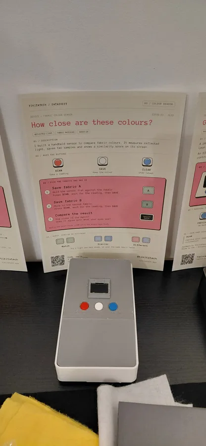
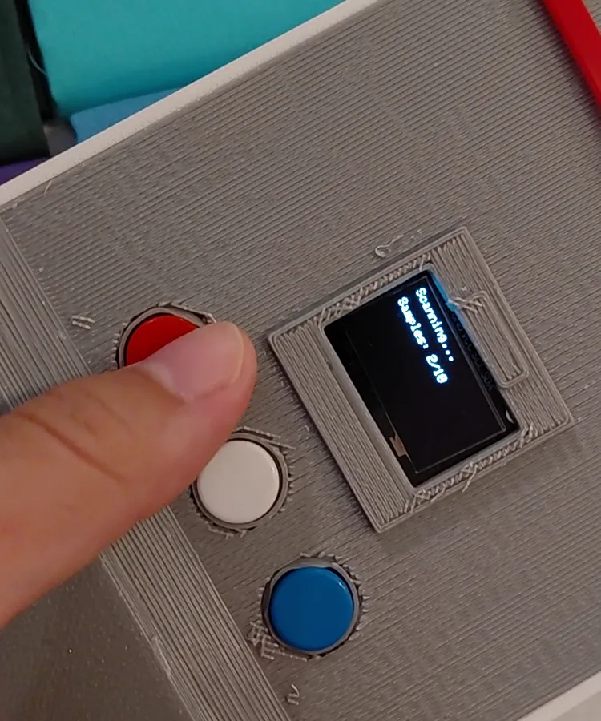
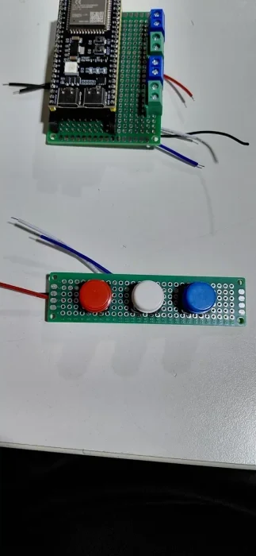
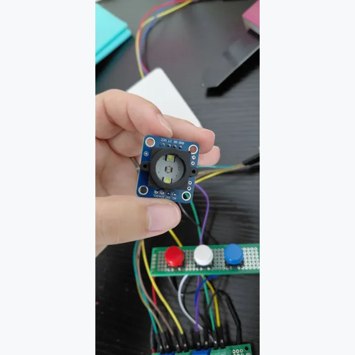

# Fabric Colour Sensor

> A handheld ESP32-S3 scanner that compares two fabric colours on a small OLED screen.

  
  
  
  

## What it does

The illuminated sensor captures a fabric sample, then compares it with a second sample. The screen shows RGB readings and a Match, Similar or Different result.

| Button | Action |
| --- | --- |
| Red - Scan | Capture a colour |
| White - Save | Keep it as sample A, then sample B |
| Blue - Clear | Undo the latest reading |

**Try it:** hold the sensor flat against fabric, scan and save A, then scan and save B. Press Clear until the screen says Ready to start a new pair.

## Bill of materials

| Qty | Part | Unit cost |
| --- | --- | ---: |
| 1 | ESP32-S3-N16R8 | £3.35 |
| 1 | GY-33 TCS34725 colour sensor | £4.89 |
| 1 | 0.96-inch I2C OLED, 128 x 64 | Included in starter kit |
| 3 | Momentary buttons: red, white, blue | Included in starter kit |
| 1 each | 50 x 70 mm and 20 x 80 mm perfboard | From £8.99 assorted pack |
| 4 | 2-way screw terminal blocks, 5.08 mm pitch | £0.30 |
| 2 | Female socket header strips, cut to 22 contacts | £0.10 per strip |
| As needed | Hook-up wire, jumpers and solder | Shared supplies |
| 1 | USB data cable and USB power supply | Already owned |
| 1 set | Printed frame, front, rear and divider | £5.43 filament |
| 2+ | Fabric samples | Shared fabric purchase |

## Wiring

Power the ESP32-S3 by USB. Both modules use 3V3 and a common GND.

| Connection | ESP32-S3 pin |
| --- | --- |
| OLED SDA / SCL | GPIO4 / GPIO5 |
| GY-33 CT / DR | GPIO9 (RX) / GPIO8 (TX) |
| Scan / Save / Clear | GPIO7 / GPIO10 / GPIO12 |
| Other side of each button | GND |

The GY-33 uses UART at 9600 baud. The OLED uses I2C address `0x3C`. Buttons use internal pull-ups.

## Firmware

1. Install the ESP32 board package in Arduino IDE.
2. Install **Adafruit GFX** and **Adafruit SSD1306** with their dependencies.
3. Open [main/main.ino](main/main.ino), select your ESP32-S3 board and port, then upload.
4. Open Serial Monitor at **115200 baud**.

### Calibration

Each scan averages ten readings. With the enclosure fitted, scan black and white fabric three times each; average the raw R/G/B/C values and update the `BLACK_*` and `WHITE_*` constants in the sketch.

The comparison score is a relative guide: **85-100 Match**, **45-84 Similar**, **0-44 Different**. Keep the sensor position and lighting consistent.

## Printed enclosure

| Download | Parts |
| --- | --- |
| [White parts](print/colour-sensor-white.3mf) | Frame and front panel, two plates |
| [Black parts](print/colour-sensor-black.3mf) | Rear shell and light divider |

The current design history is also available in [Onshape](https://cad.onshape.com/documents/f1365f86604a599dc2108d09/w/d51fb6365f3808e14df16205/e/ea2ccd3c4be893841bb637a2).

Recorded profile: Bambu Lab P1S, 0.4 mm nozzle, textured PEI plate, 0.2 mm layers, three walls and 15% infill. The frame uses a 5 mm outer brim. The front and rear use automatic tree supports; the divider prints without supports.

## This project elsewhere

| Where | Link |
| --- | --- |
| Portfolio | [Fabric Colour Sensor](https://tikitatech.xyz/projects/color-sensor/) |
| CAD | [Onshape V9 design history](https://cad.onshape.com/documents/f1365f86604a599dc2108d09/w/d51fb6365f3808e14df16205/e/ea2ccd3c4be893841bb637a2) |
| YouTube | [Project overview](https://www.youtube.com/shorts/mE4jw6d4Lig) |
| Instagram | [@tikitatech](https://www.instagram.com/tikitatech/) |

## Licence

The software and firmware are available under the [MIT License](LICENSE).

The original enclosure design, build documentation and deliberately released project photographs are available under [CC BY-NC-SA 4.0](LICENSE-DESIGN.md).
